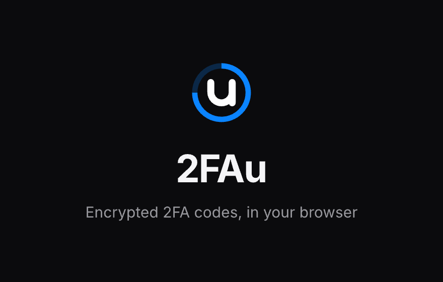
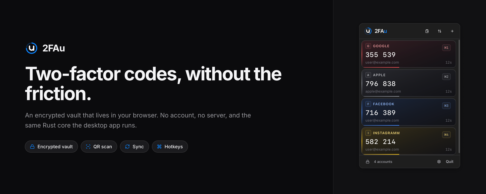
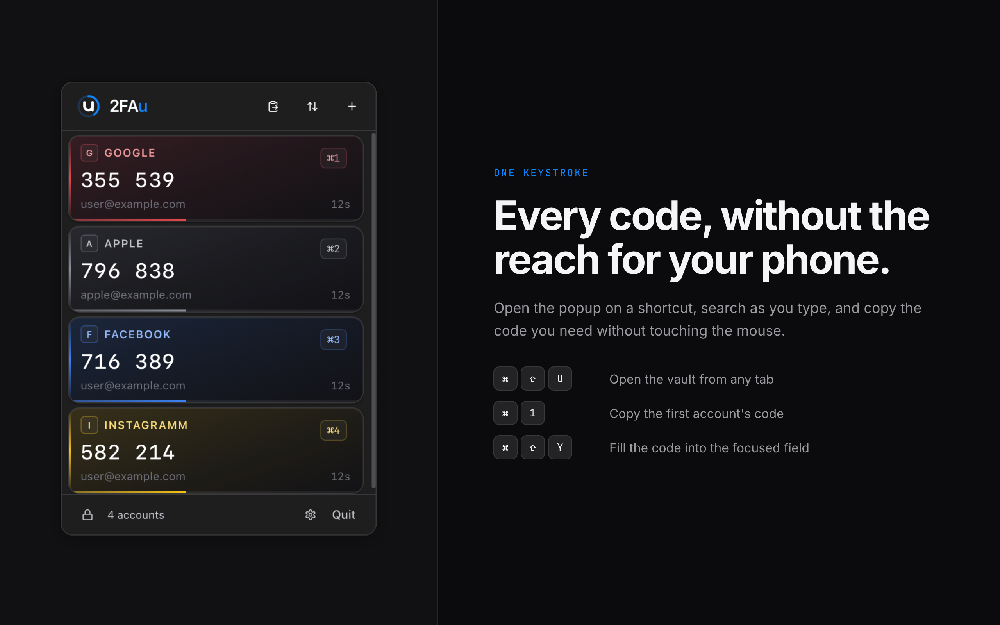
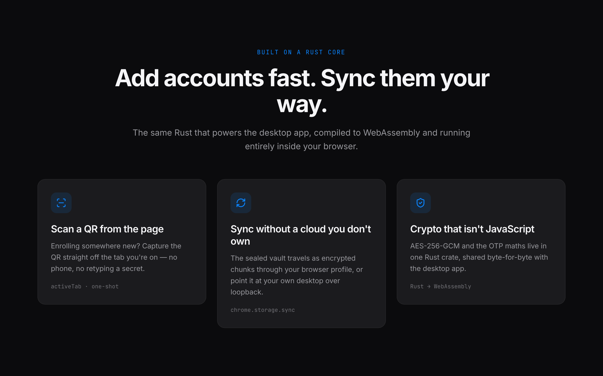
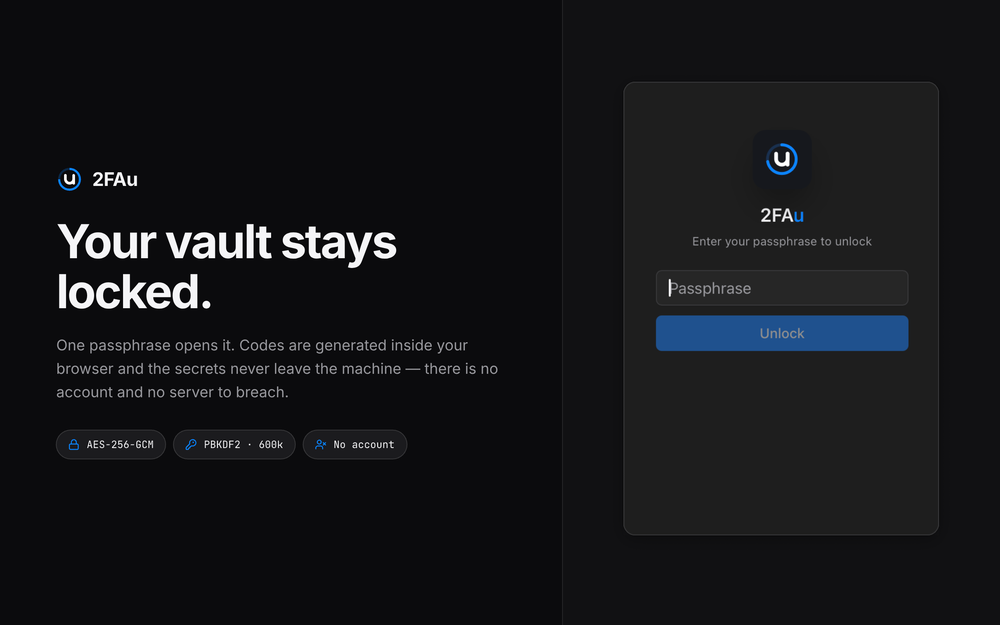

<p align="center">
  
</p>

<h1 align="center">2FAu</h1>

<p align="center">
  <b>A fast, local-first TOTP/HOTP authenticator for your desktop and your browser.</b><br>
  Your codes are generated on your device, sealed in an encrypted vault, and never sent anywhere.
</p>

<p align="center">
  <a href="https://github.com/2fau/2fau-app/releases">Download</a> ·
  <a href="#-desktop-app">Desktop app</a> ·
  <a href="#-browser-extension">Browser extension</a> ·
  <a href="#-security">Security</a>
</p>

---

2FAu keeps your two-factor codes where you actually use them — one keystroke away in
your menu bar and in every browser tab — without a phone, an account, or a server.
The same **Rust core** that generates codes and encrypts the vault runs natively in the
desktop app and as WebAssembly in the extension, so both behave identically and share the
exact same crypto.



## ✨ Highlights

- **No phone, no account, no server.** Codes are computed locally; the encrypted vault
  never leaves your machine.
- **One keystroke to any code.** Global hotkey to summon it, type-to-search, copy or
  autofill without touching the mouse.
- **Desktop + browser, one vault.** A native menu-bar app and a Chrome/Firefox extension
  built from the same Rust core.
- **Real encryption.** AES-256-GCM with a PBKDF2 (600k) key derived from one passphrase.
- **Enroll in a click.** Scan a QR straight off the page you're on — no retyping secrets.
- **Open source.** MIT-licensed, reproducible, auditable crypto in a single Rust crate.

## 🖥 Desktop app

A menu-bar / tray authenticator for **macOS, Windows, and Linux**.

- **Always a keystroke away** — a configurable global shortcut summons the popup with the
  search bar focused; **⌘/Ctrl + 1–5** copies your top accounts instantly.
- **Codes generated in Rust**, natively — the UI asks for a code by account id and never
  sees a secret.
- **Encrypted vault** unlocked by one passphrase, with configurable **auto-lock** (down to
  "Never") and **launch-on-login**.
- **Add fast** — paste an `otpauth://` URI or scan a QR from your screen.
- **Local-first**, with an optional device↔device sync bridge over loopback.

## 🧩 Browser extension

The same encrypted vault, in **Chrome, Edge, and Firefox** (Manifest V3).



- **Popup vault** with colour-tinted account rows and search-as-you-type.
- **Hotkeys built in:**
  - **⌘⇧U / Ctrl+Shift+U** — open the vault from any tab
  - **⌘/Ctrl + 1–5** — copy an account's code
  - **⌘⇧Y / Ctrl+Shift+Y** — autofill the code into the focused field
- **Scan a QR from the current tab** — enroll somewhere new without a phone.
- **Sync your way** — the sealed vault travels as encrypted chunks through your browser
  profile (`chrome.storage.sync`), or point it at your own desktop over loopback.



## 🔒 Security



- **Local-first by design** — no account to create, no server to breach; secrets never
  leave the device.
- **AES-256-GCM** vault, key derived with **PBKDF2 · 600k** iterations from your passphrase.
- **Secrets are quarantined** — they live only inside the encrypted vault blob, never in the
  UI model, and codes are computed in Rust.
- **One crypto core** — the OTP maths and encryption live in one Rust crate, shared
  byte-for-byte between the desktop app and the WebAssembly the extension runs.

## 📥 Install

- **Desktop:** grab the installer for your OS from the
  [Releases page](https://github.com/2fau/2fau-app/releases)
  (`.dmg` / `.msi` / `.AppImage` / `.deb` / `.rpm`).
- **Firefox:** install the add-on from addons.mozilla.org *(listed submission in review)*.
- **Chrome / Edge:** load the unpacked `dist/` from a release, or install from the Web Store
  once published.

---

## For developers

Critical logic (OTP generation, crypto, storage, merge) is written **once in Rust**
(`crates/twofau-core`) and shared two ways:

- **native** — linked directly by the Tauri 2 desktop app (macOS / Windows / Linux).
- **WASM** — via `crates/twofau-wasm` → `packages/core-wasm`, consumed by the browser
  extension and any web context.

A shared React UI (shadcn + lucide, macOS look) talks to a swappable `VaultService` port, so
the same components run over Tauri IPC, direct WASM calls, or an HTTP backend.

### Layout

```
crates/twofau-core     pure Rust: HOTP/TOTP, base32, otpauth, model, vault crypto, merge
crates/twofau-wasm     wasm-bindgen wrapper (RNG + clock helpers live only here)
packages/core-wasm     wasm-pack output + ts-rs bindings + typed TS index
packages/ui            shared React UI (@twofau/ui) + Storybook + Vitest
apps/twofau-app        Tauri 2 desktop app (tray agent + popup)
apps/twofau-extension  browser extension (MV3): popup, options, service worker
apps/twofau-site       marketing site (Astro)
```

### Develop

```bash
pnpm install
cargo test -p twofau-core        # unit tests + emits packages/core-wasm/bindings (ts-rs)
pnpm build:core-wasm             # wasm-pack build --target web
pnpm tauri dev                   # run the desktop tray app
```

Full command list and the platform gotchas: [`docs/DEVELOPMENT.md`](docs/DEVELOPMENT.md).

### Design invariants

- **Time-pure:** OTP functions take `unix_time`; the core never reads the clock.
- **RNG-free:** the core never generates UUIDs, salts or nonces; the host supplies them.
- **Secret-free `Account`:** secrets live only in `StoredAccount`, never in the UI model.
- **UI knows no backend:** every component goes through the `VaultService` port.

### Docs

- [`CLAUDE.md`](CLAUDE.md) — orientation + hard invariants
- [`docs/ARCHITECTURE.md`](docs/ARCHITECTURE.md) — module map, data flow, vault format
- [`docs/DEVELOPMENT.md`](docs/DEVELOPMENT.md) — commands, verification, traps
- [`docs/ROADMAP.md`](docs/ROADMAP.md) — sub-projects and known debt
- [`docs/superpowers/specs/`](docs/superpowers/specs) — per-sub-project design specs

## License

MIT — see [`LICENSE`](LICENSE).
